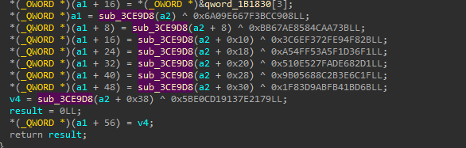
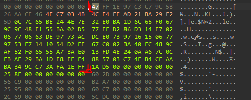
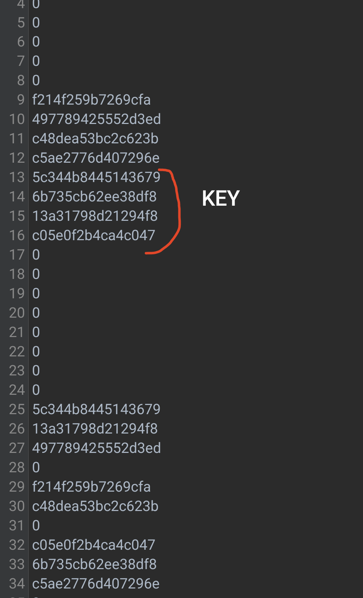

# Brawl Stars Reverse Engineering (BSRE)

This guide demonstrates the process of deobfuscating the `PapperKey` in Brawl Stars.
**Note:** These methods will work as long as Supercell has not updated or changed their key obfuscation methods.

[Turkce readme Version](READMETR.md)
---

## Disclaimer

This project is intended for educational and research purposes only. The author(s) do not endorse, encourage, or take responsibility for any misuse or violation of laws or terms of service related to the content or code provided here.

By using this project, you agree that you are solely responsible for ensuring compliance with applicable laws and agreements. Any unauthorized use of this project is strictly prohibited and done at your own risk.

Use this software responsibly and ethically.
---

## Overview
I utilized the `arm64` library for this process, but you can apply the same method to the `arm32` library.

### Method 1: Locating the `deobfuscate` Function
The first step is finding `deobfuscate` function. To do this:

1. Search for `0x6A09E667` value in **IDA Pro**.
2. Locate the function that utilizes this value. there is deobfuscation function near the value. For example, the function `sub_3CE9D8` is used for deobfuscation in the `arm64` library.



Once located, you can use this function by writing its address into the `decrypt_key_addr` variable in `libfrida-script.js`. Here's an example snippet:

```javascript
const module = Process.findModuleByName("libg.so");
const base = module.base;
Memory.protect(base, module.size, "rwx");

const decrypt_key_addr = base.add(0x3CE9D8); //update function

let decrypt_key = new NativeFunction(decrypt_key_addr, "uint", ["pointer"]);

function reverse_hex(hex_string) {
    if (hex_string.length % 2 !== 0) {
        hex_string = '0' + hex_string;
    }
    let byte_array = [];
    for (let i = 0; i < hex_string.length; i += 2) {
        byte_array.push(parseInt(hex_string.substr(i, 2), 16));
    }
    
    byte_array.reverse();
    let reversed_hex = byte_array.map(byte => {
        let hex = byte.toString(16).toUpperCase();
        return hex.length === 1 ? '0' + hex : hex;
    }).join('');
    
    return reversed_hex;
}


let key = "";
for(let i = 0; i < 32; i+=4){
    key += reverse_hex(decrypt_key(ptr(i)).toString(16));
}

console.log("THE KEY: " + key);
```

---

### Method 2: Extracting the Obfuscated Key
Next, locate the obfuscated key. This key is used in the `deobfuscate` function. but another method exist and im using it:

1. Search for the following bytes in **IDA Pro**:
   ```
   1A D5 00 00 00 00 00 00
   ```
   These bytes always appear directly after the obfuscated key.
2. Extract the key from the surrounding data.

Example visualization:



The obfuscated key in this example: 
```
47FF1E97C3C79C5B26AACF464EC7034B4CE4FFAD21BA29F25D0C7C65BE244E7E32E0BA1D6C65F0679C9C48E155BA02D577FED286D314E70206770663DE9773ACDCE07397161506779753E7141054D2FE67C002BA40EC489CAF52F06555A7BAE013FD4E240AA67C0CFBAF29BA1DE8FFE4885703C74EB4CFAABA349CC73AFA1EFF
```

---

### Using the Obfuscated Key in Your Code
1. Copy the obfuscated key.
2. Write it into your `main.cpp`.

Here is an example:

just replace `server_public_key_str`
```cpp
#include <iostream>
#include <string>
#include <sstream>
#include <iomanip>

const std::string server_public_key_str = "OBFUSCATED KEY BYTES";

std::string ByteArrayToHex(const unsigned char* byteArray, size_t length) {
	std::stringstream hexStream;
	hexStream << std::hex << std::setfill('0');

	for (size_t i = 0; i < length; ++i) {
		hexStream << std::setw(2) << static_cast<int>(byteArray[i]);
	}

	return hexStream.str();
}

void StringToHex(const std::string& hexString, unsigned char* outputArray) {
	if (hexString.length() % 2 != 0) {
		throw std::invalid_argument("Hex string must have an even length.");
	}

	size_t length = hexString.length() / 2;
	for (size_t i = 0; i < length; ++i) {
		std::string byteString = hexString.substr(i * 2, 2);
		outputArray[i] = static_cast<unsigned char>(std::stoi(byteString, nullptr, 16));
	}
}

unsigned char* LoadServerPublicKey(unsigned short* server_public_key_obf) {
	unsigned char* server_public_key = (unsigned char*)malloc(32);
	
	if (server_public_key == NULL) return NULL;

	for (int i = 0; i < 16; i++) {
		int v16 = server_public_key_obf[31 - 2 * i + 32];
		int v17 = server_public_key_obf[2 * i + 1] ^ v16 | v16 ^ server_public_key_obf[2 * i];
		*((unsigned short*)&server_public_key[2 * i]) = (unsigned __int16)(((v17 << (11 - (i & 7))) | ((unsigned __int16)v17 >> (((i & 7) - 11) & 0xF))) ^ server_public_key_obf[31 - i + 32]);
	}
	
	return server_public_key;
}
int main() {

	unsigned char server_public_key_obf[128];
	StringToHex(server_public_key_str, server_public_key_obf);
	unsigned __int16* server_public_key_obf2 = (unsigned short*)(&server_public_key_obf[0]);
	unsigned char* server_public_key = LoadServerPublicKey(server_public_key_obf2);
	std::cout << "Result : " << ByteArrayToHex(server_public_key,32) << std::endl;
	return 0;
}
```

Compile and run the code to retrieve the deobfuscated key.


### Method 3: 
This method obtains the key by converting the output of the deobfuscater function from Litte Endian to Big Endian like other methods. It uses some filters because it is not a Native Function. This code can be used without filters: 



Replace `offset` with the offset of the deobfuscater function:

```javascript
function reverse(value) { //Little Endian to Big Endian Function
    let reversed = 0n;
    const bytelen = Math.ceil(value.toString(16).length / 2);
    for (let i = 0; i < bytelen; i++) {
        reversed = (reversed << 8n) | (value & 0xFFn);
        value >>= 8n;
    }

    return reversed;
}

const base = Module.getBaseAddress('libg.so');
    const offset = 0x3CE9D8; //dehasher
    const address = base.add(offset);

    var isFilter = true
    var count = 0
    let buffer = '';

    Interceptor.attach(address, {
    onEnter(args) {},
    onLeave(retval) {
        count++;
        if (isFilter) {
            if ([13, 14, 15, 16].includes(count)) {
                const reversed = reverse(BigInt(retval));
                buffer += reversed.toString(16);
                if (count === 16) console.log(buffer);
            }
        } else {
            const reversed = reverse(BigInt(retval));
            const buffer = reversed.toString(16) + '\n';
            console.log(buffer);
        }
    }
});
```

---

## Conclusion
These methods provide a systematic way to extract and deobfuscate the `PapperKey` from Brawl Stars binaries. As always, ensure you use this information responsibly.

If Supercell updates their security mechanisms, these methods may become obsolete.

---
Credits: Demircnq and MehmetEfeFriday
