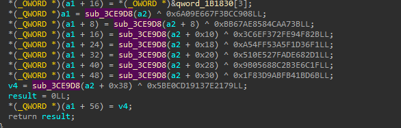

# Brawl Stars Tersine Mühendislik (BSRE)

Bu kılavuz, Brawl Stars'taki `PapperKey'in gizliliğini kaldırma işlemini göstermektedir.
**Not:** Bu yöntemler, Supercell anahtar gizleme yöntemlerini güncellemediği veya değiştirmediği sürece çalışacaktır.

---

## Yasal Uyarı

Bu proje sadece eğitim ve araştırma amaçlıdır. Yazar(lar), burada sağlanan içerik veya kodla ilgili herhangi bir kötüye kullanım veya yasa veya hizmet şartlarının ihlalini onaylamaz, teşvik etmez veya sorumluluk almaz.

Bu projeyi kullanarak, yürürlükteki yasalara ve anlaşmalara uyulmasını sağlamaktan yalnızca kendinizin sorumlu olduğunu kabul etmiş olursunuz. Bu projenin izinsiz kullanımı kesinlikle yasaktır ve riski size aittir.

Bu yazılımı sorumlu ve etik bir şekilde kullanın.
---


## Genel Bakış
Bu işlem için `arm64` kütüphanesini kullandım, ancak aynı yöntemi `arm32` kütüphanesine de uygulayabilirsiniz.
Yöntemler:
1. Game Guardian Memory Dump(just memory dump) burayı istersen silebilirsin
2. [Demircnq](https://github.com/DemirCnq) Method(so cool) need moddable client
3. [Mehmet Efenin](https://github.com/MehmetEfeFriday) Method (so cool) need moddable client
4. Custom Deobfuscator by [Demircnq](https://github.com/DemirCnq) (so fucking cool) need just obfuscated key

### Gizlenmiş Anahtarın Çıkarılması
İlk adım gizlenmiş anahtarı bulmaktır. Bu anahtar `deobfuscate` işlevinde kullanılır. ancak başka bir yöntem var ve onu kullanıyorum:

1. Aşağıdaki baytları **IDA Pro** içinde arayın:
   ```
   1A D5 00 00 00 00 00
   ```
   Bu baytlar her zaman gizlenmiş anahtardan hemen sonra görünür.
2. Çevreleyen verilerden anahtarı çıkarın.

Örnek görselleştirme:


Bu örnekteki gizlenmiş anahtar: 
```
47FF1E97C3C79C5B26AACF464EC7034B4CE4FFAD21BA29F25D0C7C65BE244E7E32E0BA1D6C65F0679C9C48E155BA02D577FED286D314E70206770663DE9773ACDCE07397161506779753E7141054D2FE67C002BA40EC489CAF52F06555A7BAE013FD4E240AA67C0CFBAF29BA1DE8FFE4885703C74EB4CFAABA349CC73AFA1EFF
```

---
### Gizlenmiş Anahtar İle deobfuscater Fonksiyonunu Bulma
İlk adım `deobfuscate` fonksiyonunu bulmaktır. Bunu yapmak için:
1. IDA Proyu açın obfuscated keyin bulunduğu adresi G tuşunu kullanarak açın.
2. "Xref graph to" tuşuna basarak tüm xrefleri görebilirsiniz oradaki tek fonksiyon deobfuscater fonksiyonudur.


---
### Yöntem 1:


Bu yöntem deobfuscater fonksiyonunu Native Fonksiyon olarak kullanarak resimde bulunan mantıkla obfuscated keyi deobfuscate eder.
deobfuscater fonksiyonunun adresini `libfrida-script.js` içindeki `decrypt_key_addr` değişkenine adresini yazarak kullanabilirsiniz. İşte örnek bir kod parçacığı:

```javascript
const module = Process.findModuleByName("libg.so");
const base = module.base;
Memory.protect(base, module.size, "rwx");

const decrypt_key_addr = base.add(0x3CE9D8); //update function

let decrypt_key = new NativeFunction(decrypt_key_addr, "uint", ["pointer"]);

function reverse_hex(hex_string) {
    if (hex_string.length % 2 !== 0) {
        hex_string = '0' + hex_string;
    }
    let byte_array = [];
    for (let i = 0; i < hex_string.length; i += 2) {
        byte_array.push(parseInt(hex_string.substr(i, 2), 16));
    }
    
    byte_array.reverse();
    let reversed_hex = byte_array.map(byte => {
        let hex = byte.toString(16).toUpperCase();
        return hex.length === 1 ? '0' + hex : hex;
    }).join('');
    
    return reversed_hex;
}


let key = "";
for(let i = 0; i < 32; i+=4){
    key += reverse_hex(decrypt_key(ptr(i)).toString(16));
}

console.log("THE KEY: " + key);

```

## Yöntem 2
Bu yöntem deobfuscater fonksiyonunun çıktıları diğer yöntemler gibi Litte Endiandan to Big Endiana çevirerek keyi elde eder.
Native Fonksiyon olmadığı için bazı filtreler kullanır.
Filtresizde bu kod kullanılabilir:


`offset` değerini deobfuscater fonksiyonunun offseti ile değiştirin:
```javascript
function reverse(value) { //Little Endian to Big Endian Function
    let reversed = 0n;
    const bytelen = Math.ceil(value.toString(16).length / 2);
    for (let i = 0; i < bytelen; i++) {
        reversed = (reversed << 8n) | (value & 0xFFn);
        value >>= 8n;
    }

    return reversed;
}

const base = Module.getBaseAddress('libg.so');
const offset = 0x3CE9D8; //dehasher
const address = base.add(offset);

var isFilter = true
var count = 0
let buffer = '';

Interceptor.attach(address, {
    onEnter(args) {},
    onLeave(retval) {
        count++;
        if (isFilter) {
            if ([13, 14, 15, 16].includes(count)) {
            const reversed = reverse(BigInt(retval));
            buffer += reversed.toString(16);
            if (count === 16) console.log(buffer);
        }
    } else {
        const reversed = reverse(BigInt(retval));
        const buffer = reversed.toString(16) + '\n';
        console.log(buffer)
    }
}
});
```
### Yöntem 3 Gizlenmiş Anahtarı Custom Deobfuscator ile Deobfuscate Etmek
1. Gizlenmiş anahtarı kopyalayın.
2. Bunu `main.cpp` dosyanıza yazın.

İşte bir örnek:

sadece `server_public_key_str` yerine
```cpp
#include <iostream>
#include <string>
#include <sstream>
#include <iomanip>

const std::string server_public_key_str = "47FF1E97C3C79C5B26AACF464EC7034B4CE4FFAD21BA29F25D0C7C65BE244E7E32E0BA1D6C65F0679C9C48E155BA02D577FED286D314E70206770663DE9773ACDCE07397161506779753E7141054D2FE67C002BA40EC489CAF52F06555A7BAE013FD4E240AA67C0CFBAF29BA1DE8FFE4885703C74EB4CFAABA349CC73AFA1EFF";

std::string ByteArrayToHex(const unsigned char* byteArray, size_t length) {
	std::stringstream hexStream;
	hexStream << std::hex << std::setfill('0');

	for (size_t i = 0; i < length; ++i) {
		hexStream << std::setw(2) << static_cast<int>(byteArray[i]);
	}

	return hexStream.str();
}

void StringToHex(const std::string& hexString, unsigned char* outputArray) {
	if (hexString.length() % 2 != 0) {
		throw std::invalid_argument("Hex string must have an even length.");
	}

	size_t length = hexString.length() / 2;
	for (size_t i = 0; i < length; ++i) {
		std::string byteString = hexString.substr(i * 2, 2);
		outputArray[i] = static_cast<unsigned char>(std::stoi(byteString, nullptr, 16));
	}
}

unsigned char* LoadServerPublicKey(unsigned short* server_public_key_obf) {
	unsigned char* server_public_key = (unsigned char*)malloc(32);
	
	if (server_public_key == NULL) return NULL;

	for (int i = 0; i < 16; i++) {
		int v16 = server_public_key_obf[31 - 2 * i + 32];
		int v17 = server_public_key_obf[2 * i + 1] ^ v16 | v16 ^ server_public_key_obf[2 * i];
		*((unsigned short*)&server_public_key[2 * i]) = (unsigned __int16)(((v17 << (11 - (i & 7))) | ((unsigned __int16)v17 >> (((i & 7) - 11) & 0xF))) ^ server_public_key_obf[31 - i + 32]);
	}
	
	return server_public_key;
}
int main() {

	unsigned char server_public_key_obf[128];
	StringToHex(server_public_key_str, server_public_key_obf);
	unsigned __int16* server_public_key_obf2 = (unsigned short*)(&server_public_key_obf[0]);
	unsigned char* server_public_key = LoadServerPublicKey(server_public_key_obf2);
	std::cout << "Result : " << ByteArrayToHex(server_public_key,32) << std::endl;
	return 0;
}

```

Gizliliği kaldırılmış anahtarı almak için kodu derleyin ve çalıştırın.

---

## Sonuç
Bu yöntemler, Brawl Stars ikili dosyalarından `PapperKey`i çıkarmak ve deobfuscate etmek için sistematik bir yol sağlar. Her zaman olduğu gibi, bu bilgileri sorumlu bir şekilde kullandığınızdan emin olun.

Supercell güncelleme yaparsa
güvenlik mekanizmaları, bu yöntemlerin geçerliliğini yitirmesine neden olabilir.

---

## Credits 
[Demircnq](https://github.com/DemirCnq)
[MehmetEfeFriday](https://github.com/MehmetEfeFriday)
